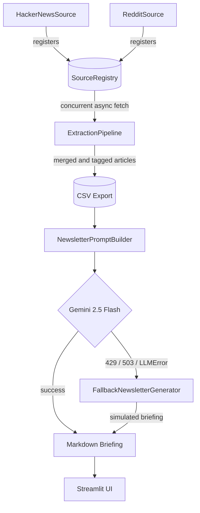

# 🧠 AI Tech Briefing Engine

**An autonomous, multi-source content intelligence pipeline — concurrent extraction, AI synthesis, and graceful degradation, built on a Strategy-pattern core.**

AI Tech Briefing Engine concurrently extracts articles from pluggable data sources, synthesizes them into a polished editorial briefing with Google's Gemini 2.5 Flash, and degrades gracefully to a high-quality simulated briefing if the AI provider is temporarily unavailable. Every extraction source is a swappable strategy behind a single protocol — adding a new one is a one-file, zero-core-changes operation.

---

## Architecture



### Extraction — Strategy Pattern

Every data source implements one protocol:

```python
class IContentSource(Protocol):
    @property
    def source_id(self) -> str: ...
    async def extract(self, limit: int = 20) -> list[Article]: ...
```

`ExtractionPipeline` never imports a concrete source. It asks `SourceRegistry` for whatever's registered, then fetches all of them concurrently with `asyncio.gather()` — a source that's slow doesn't hold up the others, and a source that fails outright doesn't take down the batch; the pipeline exports whatever succeeded and only raises if *every* source fails.

`HackerNewsSource` is a live implementation. `RedditSource` ships with simulated data — a deliberate choice to prove the concurrency model without depending on Reddit's authenticated API, which has required OAuth for reliable access since 2023. Swapping in a live feed is a change contained entirely to that one file.

### Synthesis and Fallback

Every failure mode in the pipeline is a specific, typed exception — never a bare `Exception`:

```
BriefingEngineError                    base — catch this for "any pipeline failure"
├── ScrapingError                      extraction: network, parsing, unregistered source
├── ConfigurationError                 missing or invalid GEMINI_API_KEY
├── RepositoryError                    CSV / Markdown read or write failure
└── LLMError                           AI generation layer
    ├── LLMQuotaExceededError          HTTP 429 — quota / rate limit
    └── LLMServiceUnavailableError     HTTP 503 — provider overloaded
```

That typing is what makes graceful degradation possible: `ConfigurationError` and `RepositoryError` are treated as hard failures — a real setup or data problem a fallback would just paper over — while `LLMError` and its subclasses trigger `FallbackNewsletterGenerator`, which produces an editorial-quality simulated briefing on the spot. A live demo never shows a stack trace because the API had a bad minute.

### Configuration

`EnvironmentConfig` checks `os.environ` before ever touching a `.env` file. The same code runs unmodified locally, in Docker, or on any platform that injects secrets as environment variables — Streamlit Cloud, Kubernetes, CI/CD — with zero code changes between them.

---

## Tech Stack

| Layer | Technology | Purpose |
|---|---|---|
| Language | Python 3.12 | Modern typing (`X \| None`, `list[T]`) throughout |
| Concurrency | asyncio, httpx | Concurrent multi-source I/O, no threads or processes |
| Extraction | BeautifulSoup4 | HTML parsing for the Hacker News strategy |
| AI Synthesis | google-genai (Gemini 2.5 Flash) | Structured briefing generation from raw article data |
| Web UI | Streamlit | Real-time pipeline status, briefing archive, download |
| Testing | pytest, pytest-asyncio | Mocked, hermetic tests — zero real network or API calls |
| Containerization | Docker, Docker Compose | Multi-stage build, non-root runtime, health checks |
| Configuration | python-dotenv | Cloud-first, local-fallback secret resolution |
| API Backend | FastAPI, Uvicorn | Enterprise-grade REST API decoupled from UI |

---

## Quick Start — Docker

```bash
# 1. Add your Gemini API key (free at https://aistudio.google.com/app/apikey)
echo "GEMINI_API_KEY=your_key_here" > .env

# 2. Build and start
docker-compose up --build
```

Open **http://localhost:8501**. `output/` and `newsletters/` are mounted as volumes, so scraped data and generated briefings persist across restarts.

---

## Local Development Setup

For running tests or contributing without Docker:

```bash
python -m venv venv
source venv/bin/activate        # macOS / Linux
venv\Scripts\Activate.ps1       # Windows PowerShell

pip install -r requirements-dev.txt
```

## Running the Test Suite

```bash
pytest tests/ -v
```

With coverage:

```bash
pytest tests/ --cov=smart_data_extractor --cov=ai_newsletter --cov-report=term-missing
```

The suite covers both orchestrators — `ExtractionPipeline` and `AINewsletterGenerator` — with every external boundary mocked: fake `IContentSource` test doubles stand in for real network calls, and the Gemini SDK client is mocked so no test ever hits a real API. Currently 10 tests at 78% coverage on the two pipeline modules, including a timing-based assertion that proves multi-source extraction is genuinely concurrent, not just structured to look that way.

---

## Enterprise Readiness

This project isn't "enterprise-grade" because of scale it's been asked to handle yet — it's built around the failure modes that scale actually produces.

**Extending without touching the core.** Every source is a Strategy implementing one protocol. `ExtractionPipeline` only knows `SourceRegistry`. A new source — live or third-party — is one new file and one registration line; the orchestration logic never changes. That's the Open/Closed Principle enforced by the type system, not just followed by convention.

**Concurrency that matches the workload.** Extraction is I/O-bound: waiting on HTTP responses, not CPU. `asyncio.gather()` means N sources cost roughly as much wall-clock time as the *slowest* one, not their sum — verified directly in the test suite.

**Partial failure isn't total failure.** If one source is down, the pipeline still exports results from every source that succeeded, instead of a naive `try/except` around the whole batch throwing away good data alongside the bad.

**Every failure is a typed decision, not a stack trace.** The exception hierarchy means any future caller — a FastAPI route handler, a background job queue — can catch `ConfigurationError` and `LLMError` distinctly and decide, per exception type, whether that's a hard stop or a soft degrade.

**Configuration that doesn't care where it runs.** Same code, unmodified, locally, in Docker, or on any cloud platform that injects secrets as environment variables.

---

## Project Structure

```
.
├── app.py                          # Streamlit web UI
├── api.py                          # FastAPI server exposing the pipeline as a REST API
├── smart_data_extractor.py         # ExtractionPipeline + CSVExporter (async, multi-source)
├── ai_newsletter.py                # AINewsletterGenerator + Gemini integration
├── core/
│   ├── exceptions.py                # Domain exception hierarchy
│   └── protocols.py                 # Article model + IContentSource strategy protocol
├── infrastructure/
│   └── sources/
│       ├── base.py                  # Shared async HTTPClient (httpx, retry logic)
│       ├── hacker_news.py           # HackerNewsSource — live strategy
│       ├── reddit.py                # RedditSource — simulated strategy
│       └── registry.py              # SourceRegistry — strategy factory
├── tests/
│   ├── conftest.py                  # Shared fixtures, mocks, test doubles
│   └── test_pipeline.py             # Core pipeline tests
├── output/                          # Scraped CSV exports (generated at runtime)
├── newsletters/                     # Generated Markdown briefings (generated at runtime)
├── Dockerfile                       # Multi-stage build
├── docker-compose.yml               # Orchestration + volume persistence
├── requirements.txt                 # Production dependencies
├── requirements-dev.txt             # + testing dependencies
└── pytest.ini
```

---

## Roadmap

- **Live secondary source** — a real OAuth-based Reddit integration replacing the current simulated one
- **GitHub Actions CI** running the pytest suite on every push
- **Constructor-injected dependencies** for the orchestrators, so unit tests no longer need to mock at the SDK boundary

## License

MIT — see `LICENSE`. *(Add a `LICENSE` file to the repo root if one isn't there yet; this README assumes MIT as a sensible default for an open portfolio project, not a confirmed choice.)*